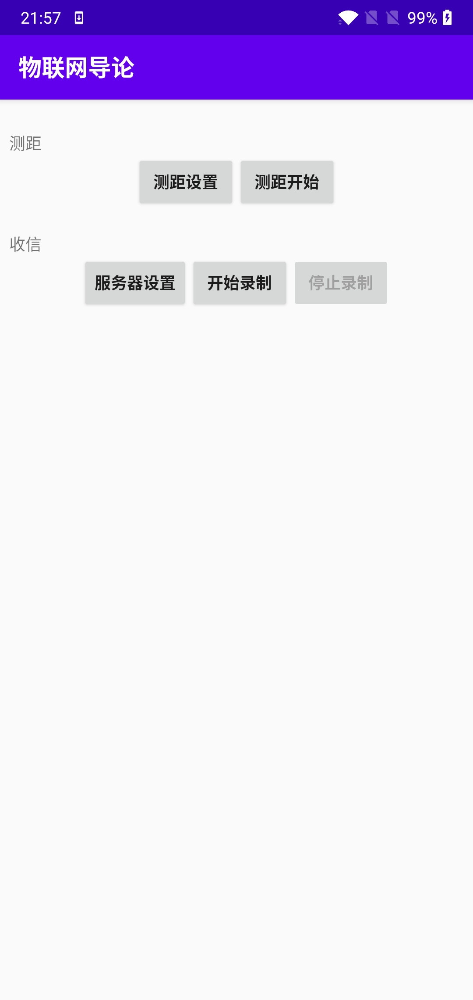
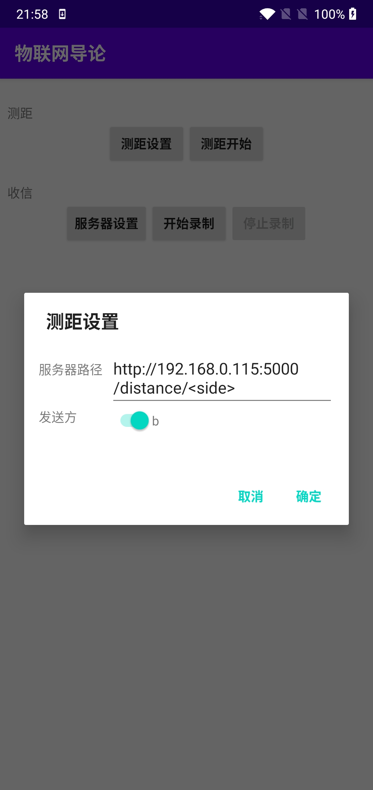

# 物联网大作业报告

沈冠霖 郭玉楷 周恒宇

## 1. 基本情况

### 1.1 开发环境

- python 3.7.1
- matplotlib 3.3.0
- scipy 1.5.2
- statsmodels 0.12.1
- PyAudio 0.2.11
- numpy 1.19.1
- requests 2.24.0
- Flask 1.1.2

### 1.2 运行方法

我们的代码运行在src下，首先进入这个目录，输入如下命令安装依赖

```shell
pip install -r requirements.txt
```

之后测试FSK解码，请把excel格式的文件命名为content.csv放在src根目录下，将待解调的文件命名为res.wav放在src/receive文件夹下，输入如下命令来运行解码测试程序，获取准确率和解码结果。

```shell
python FSK.py
```

准确率在命令行显示，解码结果在src根目录下的result.csv下

### 1.3 分工

沈冠霖负责FSK调制解调算法

郭玉楷负责蓝牙通信

周恒宇负责测距

## 2. FSK算法

### 2.1 实现方法

我们采用2FSK算法实现调制解调。调制时我们设置每个bit为一个长度为0.025s，频率为4000HZ（0）或6000HZ（1）的信号，组合成一个完整信号。解调时我们先通过匹配前导码的方法找到数据包的开头，然后对每个长度为0.025s的窗口进行傅立叶变化，计算结果最大的频率距离4000HZ还是6000HZ近即可。

匹配前导码是FSK算法的最大难点，因为实际通信的时候并不知道数据包从哪里开始，还有噪声等因素影响。我们首先将前导码的调制结果和整个信号求了相关性，结果如下：


对第一个峰放大，结果如下：


可以看出，前20个窗口，也就是前20*0.025 = 0.5s的时间，出现了十个逐步增加的波峰。而最高的波峰应该是前导码完全匹配上的位置，也就是前导码第一个bit对应的窗口的开始位置。

为了正确匹配前导码，我们算法如下：对相关结果，找第一个大于起始阈值的位置t0（起始阈值用来避免前面的录音空白造成的影响），然后求[t0, t0 + 20 * window_length]这个范围内的最大值对应的位置作为数据包开始的位置。

对于一个录音文件里有多个数据包的情况，我们会先匹配第一个数据包的开始，然后先解调前20个bit的前导码和之后长度固定、含有包文长度信息的包头，然后根据包头信息解调包文。之后我们从第一个数据包的结束开始，匹配第二个数据包的前导码以解调包头，以此类推，直到找不到前导码为止。

### 2.2 结果

对于助教提供的content.csv文件和res.wav文件，我们对每个数据包的解码结果都是100%正确。

## 3. 蓝牙通信

### 3.1 实现方法


### 3.2 结果

#### 3.2.1 距离对传输性能影响

| 距离/cm | 丢包率/% | 误码率/% |
| :-----: | :------: | :------: |
|   20    |          |          |
|   40    |          |          |
|   60    |          |          |
|   80    |          |          |
|   100   |          |          |

#### 3.2.2 抗干扰能力

| 噪声大小 | 丢包率/% | 误码率/% |
| :-----: | :------: | :------: |
|   小    |          |          |
|   中   |          |          |
|   大    |          |          |

#### 3.2.3 遮挡影响（固定距离50cm）

| 书籍厚度/cm | 丢包率/% | 误码率/% |
| :-----: | :------: | :------: |
|   1    |          |          |
|   5    |          |          |
|   10    |          |          |
|   20    |          |          |


## 4. 测距

### 4.1 实现方法

#### 4.1.1 客户端

客户端有 Python 和 Android 两种。两侧的客户端应该尽量同时测距开始。

##### 4.1.1.1 Python 客户端

```shell
python -m distance.client --side which_side --server_url "http://server_ip_port/distance/<side>"
```

which_side 应该是 a 或 b。两个客户端应该分别设置为 a 和 b。

在 console 中每按一次回车开始一次测距。

##### 4.1.1.2 Android 客户端

<div style="display: grid; grid-template-columns: 1fr 1fr;">


</div>

和 Python 客户端设置方式一致，点击"测距开始"开始一次测距。 

#### 4.1.2 服务器前端

前端页面使用 React + Material UI 完成，使用 npm build 编译结果放在 `src/distance/static` 下作为静态文件由 Flask 提供。

#### 4.1.3 服务器解码后端

后端使用 Flask 运行一个 HTTP Server，接受来自客户端的音频文件。在两个客户端发来的音频中，分别查找两次音频的开始时间，使用 Beep-Beep 方法计算距离。

### 4.2 结果

#### 4.2.1 各个距离的测距效果

下表由两台 Android 手机测试完成，单位为 cm。方差为样本方差。

|     距离 |    20cm |    60cm |  100cm |   150cm |   200cm |
|---------:|--------:|--------:|-------:|--------:|--------:|
|        1 |   16.08 |   55.02 |  94.33 |  147.20 |  197.22 |
|        2 |   16.44 |   55.02 |  94.33 |  156.14 |  211.16 |
|        3 |   16.08 |   54.67 |  94.32 |  157.57 |  195.44 |
|        4 |   16.08 |   56.09 |  94.32 |  160.78 |  195.08 |
|        5 |   16.44 |   56.09 |  94.68 |  145.42 |  197.94 |
|        6 |   15.72 |   56.09 |  94.68 |  162.92 |  217.23 |
|        7 |   15.72 |   55.38 |  94.68 |  145.78 |  212.23 |
|        8 |   16.08 |   55.74 |  94.68 |  141.49 |  198.30 |
|        9 |   16.08 |   68.96 |  94.68 |  165.43 |  197.58 |
|       10 |   15.72 |   68.60 |  94.68 |  141.49 |  197.23 |
|     平均 |   16.04 |   58.17 |  94.54 |  152.42 |  201.94 |
|     误差 |   -3.96 |   -1.83 |  -5.46 |    2.42 |    1.94 |
| 方差(cm<sup>2</sup>) |  0.0635 | 28.3972 | 0.0303 | 74.9028 | 60.6708 |
|   成功率 | 100.00% |  83.33% | 90.91% |  45.45% |  41.67% |

* 成功率指偏差落在 &pm;25% 范围内的值占全体的比例。成功 10 组时停止测试

#### 4.2.2 噪音下测距效果

下表由两台 Android 手机测试完成，单位为 cm。方差为样本方差。噪音由放在两台手机之间的另一台手机大声播放音频产生。

|                 噪声大小 |     弱 |     中 |     强 |
|-------------------------:|-------:|-------:|-------:|
| 1                        | 102.19 | 112.9  | 108.26 |
| 2                        | 102.19 | 116.48 | 105.76 |
| 3                        | 102.19 | 99.68  | 102.54 |
| 4                        | 102.19 | 96.83  | 119.34 |
| 5                        | 102.54 | 99.68  | 102.54 |
| 6                        | 102.19 | 100.04 | 102.54 |
| 7                        | 102.19 | 100.04 | 119.34 |
| 8                        | 102.54 | 99.68  | 110.76 |
| 9                        | 102.54 | 100.04 | 119.34 |
| 10                       | 102.54 | 100.04 | 119.34 |
| 平均                     | 102.33 | 102.54 | 110.05 |
| 误差                     | 2.33   | 2.54   | 10.05  |
| 样本方差(cm<sup>2</sup>) | 0.18   | 6.53   | 7.50   |
| 成功率                   | 83.33% | 71.43% | 76.92% |

* 成功率指误差偏差落在 &pm;25% 范围内的值占全体的比例。成功 10 组时停止测试

#### 4.2.3 物体遮挡下测距效果

下表由两台 Android 手机测试完成，单位为 cm。方差为样本方差。障碍物的中心放在 50 cm 处。

1, 5, 10cm 的障碍大小约 20cm x 20cm，
20 cm 的障碍大小约 30cm x 40 cm。

|                     厚度 |     1cm |      5cm |    10cm |      20cm |
|-------------------------:|--------:|---------:|--------:|----------:|
|                        1 |  125.41 |   126.84 |  120.76 |    234.38 |
|                        2 |  116.48 |   148.28 |  120.76 |    490.92 |
|                        3 |  116.48 |   122.55 |  120.76 |    289.41 |
|                        4 |  125.05 |   139.70 |  121.12 |    297.98 |
|                        5 |  125.05 |   160.42 |  120.76 |    291.91 |
|                        6 |  116.83 |   143.27 |  121.12 |    258.32 |
|                        7 |  125.41 |   117.91 |  121.12 |    215.09 |
|                        8 |  125.05 |   117.55 |  121.12 |    241.17 |
|                        9 |  116.48 |   126.12 |  121.12 |    257.96 |
|                       10 |  125.05 |   117.55 |  120.76 |    198.30 |
|                       11 |  116.48 |   135.06 |  120.76 |    240.81 |
|                       12 |  124.69 |   135.06 |  121.12 |    224.02 |
|                       13 |  116.83 |   143.27 |  121.12 |    224.02 |
|                       14 |  125.41 |   143.63 |  121.12 |    241.17 |
|                       15 |  116.48 |   117.91 |  121.12 |    164.35 |
|                     平均 |  121.15 |   133.01 |  120.98 |    257.99 |
|                     误差 |   21.15 |    33.01 |   20.98 |    157.99 |
| 样本方差(cm<sup>2</sup>) | 18.2885 | 166.0306 | 25.8100 | 5059.3064 |
|                   成功率 |  93.75% |   83.33% | 100.00% |    83.33% |

* 成功率指选取在 (50cm, 500cm) 以内，偏差落在平均值 &pm;50% 范围内的值占全体的比例。成功 15 组时停止测试。
